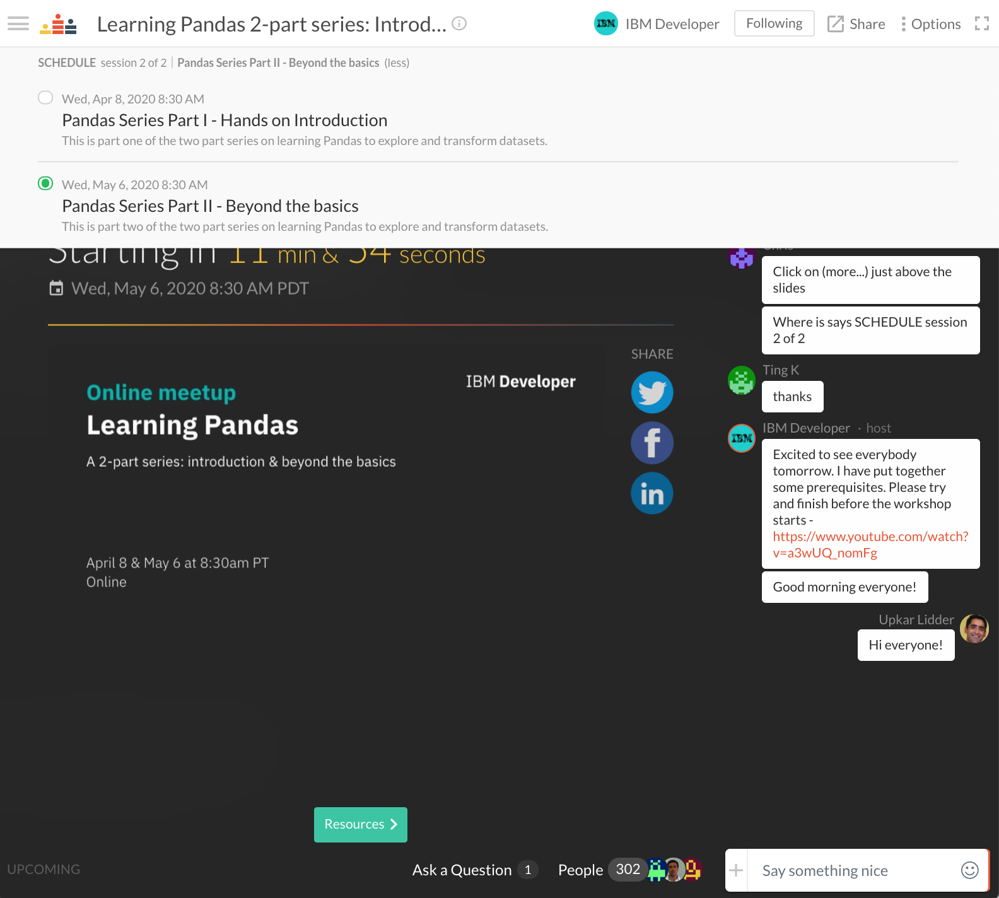

# Pandas - two part series

## Prerequisites
1. Create [IBM Cloud](https://ibm.biz/BdqZEJ) account using this link [https://ibm.biz/BdqZEJ].
1. Follow steps [in this video](https://www.youtube.com/watch?v=a3wUQ_nomFg) to create
   1. [watson studio service](https://cloud.ibm.com/catalog/services/watson-studio)
   1. [cloud object storage](https://cloud.ibm.com/catalog/services/cloud-object-storage) service
   1. [notebook to follow along](https://raw.githubusercontent.com/lidderupk/covid-19-cali/master/assets/covid-19-data-explore-session.ipynb)
1. Some [slides](https://slides.com/upkar/pandas-series) - [https://slides.com/upkar/pandas-series]

## Part I - an introduction

    ✅ how to obtain/read a data file using pandas
    ✅ how to clean noise in data
    ✅ selecting and querying data
    ✅ filtering data
    ✅ simple graphing of data

## Part II - beyond the basics

    ✅ aggregrate and summarize data using groupby
    ✅ merge multiple data into a single dataframe
    ✅ use SQL like queries

## Data Sources
- https://github.com/CSSEGISandData/COVID-19
- https://www.kaggle.com/roche-data-science-coalition/uncover#total-covid-19-tests-performed-by-country.csv
  
## Presentation
[Introduction to Jupyter Notebooks on Watson Studio](https://slides.com/upkar/pandas-series)

## Useful Links
1. **[Pandas Documentation](http://pandas.pydata.org/pandas-docs/stable/)** - http://pandas.pydata.org/pandas-docs/stable/
2. **[.str. methods on Pandas Series](http://pandas.pydata.org/pandas-docs/stable/reference/series.html#string-handling)** - http://pandas.pydata.org/pandas-docs/stable/reference/series.html#string-handling
3. **[Plotting in Pandas](http://pandas.pydata.org/pandas-docs/stable/user_guide/visualization.html)** - http://pandas.pydata.org/pandas-docs/stable/user_guide/visualization.html
4. **[Brandon Rhodes pycon video](https://www.youtube.com/watch?v=5JnMutdy6Fw)** - https://www.youtube.com/watch?v=5JnMutdy6Fw
5. **[Kaggle for datasets and sample Jupyter notebooks](https://www.kaggle.com/datasets)** - https://www.kaggle.com/datasets
6. **[SF open data](https://datasf.org/opendata/)** - https://datasf.org/opendata/
7. **[Free Watson Studio Desktop for Universities](https://www.ibm.com/products/watson-studio-desktop)** - https://www.ibm.com/products/watson-studio-desktop
8. **[IBM Cloud Sign up](https://ibm.biz/Bd2XTE)** - https://ibm.biz/Bd2XTE
9. **[IBM Data Science courses on Coursera](https://www.coursera.org/courses?query=ibm%20data%20science)**
  - **[IBM Data Science Professional Certificate](https://www.coursera.org/specializations/ibm-data-science-professional-certificate)**
  - **[Advanced Data Science with IBM Specialization](https://www.coursera.org/specializations/advanced-data-science-ibm)**

## Code Patterns
1. [Data Science](https://developer.ibm.com/patterns/category/data-science/?fa=date%3ADESC&fb=)
1. [Machine Learning](https://developer.ibm.com/patterns/category/machine-learning/?fa=date%3ADESC&fb=)
1. [Deep Learning](https://developer.ibm.com/patterns/category/deep-learning/?fa=date%3ADESC&fb=)

## FAQs
1. The video is paused for me, what do I do?
    
    You have to hit the play button in some browsers as the video does not auto play.

2. Is this webinar being recorded?
    
    Yes, the webinar is being recorded, you can view the replay on the same link once the event ends.

3. Where are the slides?
    
    See the links above for workshops and resources for each of the sessions.

4. Do you have study materials or courses available?
    
    See additional links above for additional reading materials

5. Do you have a certification ?
    
    There is no certification provided at this point, but IBM offers a number of courses and certifications on Coursera and Cognitive.ai. See the section above for a listing.

6. How do I access the replays of the individual sessions? 
    
    You can access the individual sessions by using the drop down in the top left corner as shown in the screenshot below.

      

7. Who can attend these sessions?
  
    Developers, data scientists, analysts and architects. Anyone interested in working with and exploring data.

